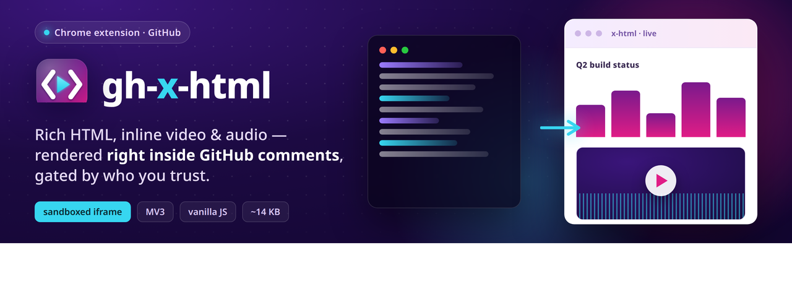
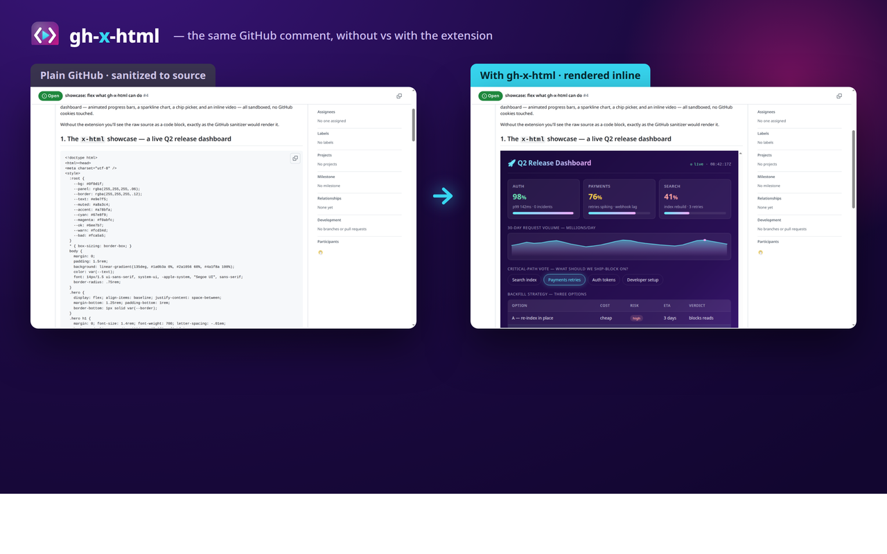

<p align="center">
  
</p>

# gh-x-html

<p align="center">
  <a href="LICENSE"></a>
  <a href="CHANGELOG.md"></a>
  
  
</p>

> Make GitHub comments render rich HTML — your own ADR pages, status dashboards, inline videos — instead of getting flattened by the sanitizer.

A Chrome extension that rewrites two things inside GitHub issue / PR / discussion / commit comments, **but only for comments authored by people you trust**:

1. **Fenced code blocks tagged `x-html`** become a sandboxed iframe that renders the HTML inside.
2. **Media links** (`.mp4`, `.webm`, `.mov`, `.mp3`, `.m4a`, `.ogg`) become inline `<video>` / `<audio>` players — works for ``, `[caption](...)`, and bare URLs.



## Install

### From the Chrome Web Store

_Coming soon — listing in review._

### From source (today)

1. Clone or download this repo.
2. Open `chrome://extensions` in Chrome / Edge / Brave / Arc / Vivaldi.
3. Enable **Developer mode** (top right).
4. Click **Load unpacked** → pick this directory.
5. Visit any GitHub page. Open the extension popup — you should already be the lone trusted author. Add coworkers as needed.

That's it. No build step. No bundle. Pure vanilla JS.

## Use it

### Rich HTML

In a GitHub comment write a fenced code block with the language tag `x-html`:

````md
```x-html
<!doctype html>
<html><head><style>
  body { font: 14px system-ui; margin: 1rem; }
  table { border-collapse: collapse; width: 100%; }
  th, td { border-bottom: 1px solid #ddd; padding: .5rem; text-align: left; }
  .pill { padding: .15rem .55rem; border-radius: 999px; font-weight: 600; font-size: .8em; background: #d1fae5; color: #065f46; }
</style></head>
<body>
  <h2>Build status</h2>
  <table>
    <tr><th>Service</th><th>Status</th></tr>
    <tr><td>api</td><td><span class="pill">passing</span></td></tr>
  </table>
</body>
</html>
```
````

Reload the GitHub tab → the fence becomes a sandboxed iframe showing the rendered HTML. Auto-sizes to fit content (via a `postMessage` resizer).

### Inline video / audio

Markdown image and link syntax both work — the extension picks the right element based on extension:

```md


[Long-form recording](https://example.com/recordings/talk.mp3)

https://example.com/clips/regression.webm
```

GitHub's own `github.com/user-attachments/...` (drag-and-drop uploads) is skipped — GitHub already inlines those natively.

## Trust model

Both rewrite paths look up the comment's author and only rewrite if that author is in the **trusted authors** allowlist (stored in `chrome.storage.sync`).

- On first install, the allowlist is seeded with **just your GitHub login** (read from `<meta name="user-login">` on the page).
- Open the popup to add or remove logins.
- Untrusted authors' fences stay as plain code blocks. Their `.mp4` links stay as plain links.

See [`docs/adr/0003-trust-model-author-allowlist.md`](docs/adr/0003-trust-model-author-allowlist.md) for the reasoning. TL;DR: the sandbox stops code from breaking out of the iframe, but doesn't stop visual spoofing of GitHub chrome. The trust model handles that.

## Security model

- Every iframe is `<iframe srcdoc sandbox="allow-scripts allow-popups allow-popups-to-escape-sandbox">`. **`allow-same-origin` is never set** — the iframe is an opaque origin: no GitHub cookies, no parent-DOM access, no top-frame navigation. Author scripts can run, but only inside their own bubble (like an embedded Codepen).
- `<video>` / `<audio>` elements are non-executable — they don't need a sandbox.
- The extension never reads `file://` URLs. The page author types the source into the fence; the extension renders that text. Threat surface is "render text already in the DOM."

See [`docs/adr/0002-sandbox-allow-scripts-no-same-origin.md`](docs/adr/0002-sandbox-allow-scripts-no-same-origin.md) for the full reasoning.

## Why this exists

GitHub's markdown sanitizer strips `<video>`, `<iframe>`, `<style>` attributes, and most non-allowlisted tags. Drag-and-drop video uploads to `user-attachments` work because GitHub adds them at render time, but anything else gets flattened. If you want to embed an external video link, a status dashboard, a chart, or an `/in-html`-style ADR page — you can't.

`gh-x-html` does the rendering GitHub refuses to do, client-side, gated by author trust.

## Limits

- **Viewers without the extension see source.** A fence is just a code block to them. The rich render is local to whoever has the extension.
- **`x-md` (Markdown fences) is not in v1.** For now type raw `x-html`.
- **No URL allowlist.** Trust is per-author. If you trust an author, you trust every link they post.
- **Brittle to GitHub DOM changes.** The author-detection walks the DOM looking for known classes / hovercard URLs. GitHub redesigns may break it — fixes go in `content.js` → `findCommentAuthor`.

## Repo layout

```
manifest.json       — MV3 manifest, content-script on github.com/*, popup
background.js       — service worker (storage seeding, badge state)
content.js          — fence + media rewriter, MutationObserver, postMessage resizer
render.html         — chrome-extension:// iframe shell that mounts fences / media
render.js           — applies the fence or media payload inside the iframe
popup.html          — trusted-authors editor UI
popup.js            — chrome.storage.sync read/write
icons/              — extension icons + source SVG
smoke-test.mjs      — Playwright-driven end-to-end sanity check
CHANGELOG.md        — release notes (Keep-a-Changelog format)
CONTEXT.md          — glossary, scope, decisions
docs/adr/           — architecture decision records
docs/store/         — Chrome Web Store icons, promo tiles, screenshots
scripts/build-zip.sh — packs the extension into dist/<name>-<version>.zip
```

## Packaging for the Chrome Web Store

```bash
./scripts/build-zip.sh   # writes dist/gh-x-html-<version>.zip
```

The zip contains only the runtime files the extension needs — `icons/icon.svg`,
`CONTEXT.md`, `docs/`, `smoke-test.mjs`, and the worktree clutter never end up
inside it.

Store-listing assets live under [`docs/store/`](docs/store/) — the 128 px icon,
the 440 × 280 small tile, the 1400 × 560 marquee, and the 1280 × 800
screenshots.

## Contributing

This is a small, intentionally vanilla extension. No bundler, no TypeScript.
The one test, `smoke-test.mjs`, drives a real Chromium via Playwright. PRs
welcome — read `CONTEXT.md` and the ADRs first to stay aligned with the design.

## License

MIT — see [LICENSE](LICENSE).
